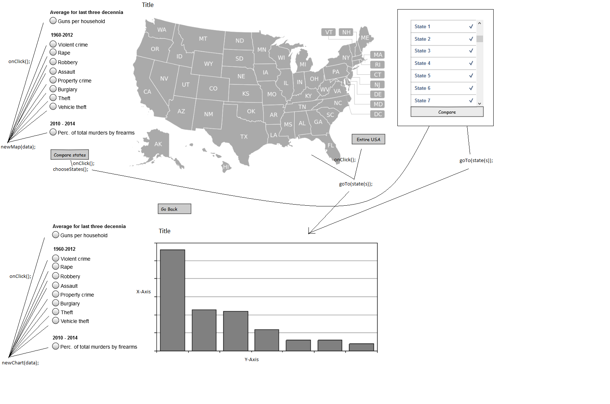

# Design document
## Minimum Viable Product (MVP)
* Kaart van de Verenigde Staten met klikbare staten (visualisatie 1).
* Kaart visualiseert verschillende variabelen (liefst alle mogelijke variabelen uit de data).
* Alle variabelen zijn ook per staat zichtbaar, in een aparte visualisatie (visualisatie 2).
* Voor elke variabele (behalve Gun Ownership) is het mogelijk om data te bekijken over een aantal jaren.
* Veranderen van jaartal gaat door middel van een slider in zowel de eerste als de tweede visualisatie.
* Het vergelijken van twee staten of meerdere staten is mogelijk, de visualisatie van deze vergelijking gebeurt op dezelfde manier als bij visualisatie 2.

## Mogelijke extra implementatie
* Het combineren van twee variabelen (bijvoorbeeld hoeveelheid wapens gecombineerd met het aantal doden door wapens).

## Methods
* `drawMap(data) // Tekent de kaart met als parameter de data`
* `drawChart(data) // Tekent de tweede visualisatie met als parameter de data`
* `drawComparison(data, states) // Tekent visualisatie voor het vergelijken van twee staten`
* `chooseStates() // Choose which states to compare`
* `getData(var, state) // Haalt de data op die hoort bij de geselecteerde variabele en eventuele staat`
* `goTo(state(s)) // Brengt de gebruiker naar de tweede visualisatie `
* `onMouseOver(this) // Laat een popup zien bij een mouseover event`

## Sketches

## API's/Frameworks
* CSS/HTML
* D3.js
* JQuery.js
* Chart.js
* XMLHttpRequest

## Data
* http://www.gunpolicy.org/.
Data over het gemiddelde wapenbezit per huishouden voor de afgelopen drie decennia

* http://www.ucrdatatool.gov/.
API voor het verzamelen van data van de FBI over misdaad per staat van 1960 tot 2012
Variabelen: Year, Population, Violent crime total, Murder and nonnegligent Manslaughter, Forcible rape, Robbery, Aggravated assault, Property crime total, Burglary, Larceny-theft, Motor vehicle theft, Violent Crime rate, Murder and nonnegligent manslaughter rate, Forcible rape rate, Robbery rate, Aggravated assault rate, Property crime rate, Burglary rate, Larceny-theft rate, Motor vehicle theft rate. Getallen zijn het aantal gevallen per 100,000 inwoners van de betreffende staat.

* https://docs.google.com/spreadsheets/d/1rR9wSLHn2nC5oJyyF2gzfcA4JS4VNgIqcj_wAPc-XzE/edit#gid=1370551484
Spreadsheet met informatie over de Amerikaanse verkiezingen 1828. Ik gebruik hiervan de Cook PVI data.

* http://www.bls.gov/home.htm
Extra variabele werkloosheid is van deze website afgehaald
Variabele: Werkloosheid als percentage van de werkende bevolking
