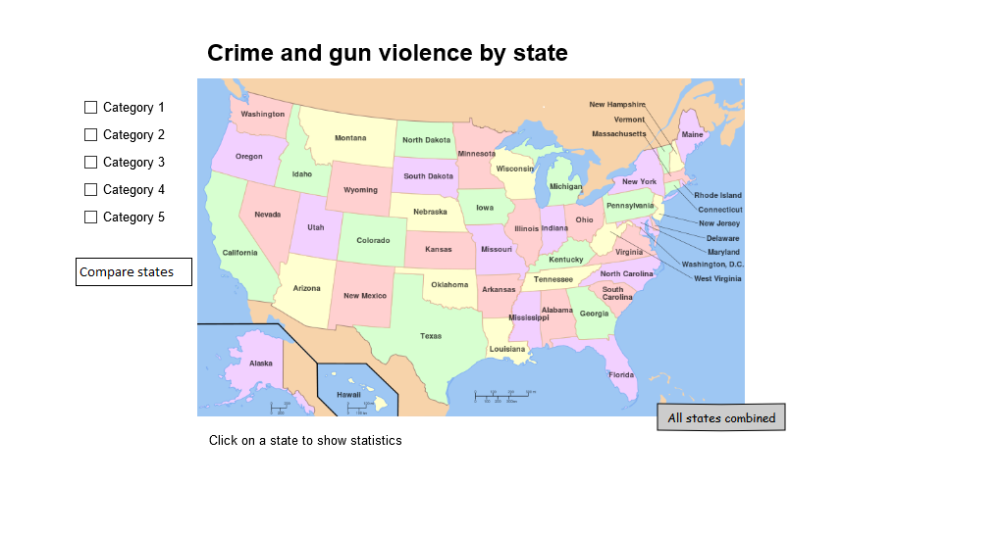

# Programmeerproject
Dit repository is voor het vak Programmeerproject van de minor Programmeren

## Project proposal
### Features
In deze visualisatie kan de gebruiker misdaadcijfers vergelijken met andere gegevens, zoals wapengebruik, werkloosheid, aantal gevangenen etcetera. Deze cijfers zijn te zien voor elke staat in de USA. De visualisatie begint met een kaart van Amerika die alle staten duidelijk weergeeft. De gerbuiker kan voor bepaalde gegevens zien hoe de elke staat daarvoor scoort, dat wordt aangegeven met een pop up en een textbox in het geval van een mouseover event (welke gegevens dat zijn moet nog worden bepaald). Daarnaast kan de gebruiker op de staten klikken om alle gegevens van die staat op een rijtje te zien in een extra visualisatie. Daarnaast zal de gebruiker de optie krijgen twee staten met elkaar te vergelijken en om gegevens te filteren. De gebruiker zal ook de optie hebben om te kiezen voor welk jaar hij de gegevens wil zien.

### Sketches
SVG Map United States

Visualization by state

### Data
* http://www.gunpolicy.org/
Data over het gemiddelde wapenbezit per huishouden voor de afgelopen drie decennia

* http://www.ucrdatatool.gov/
API voor het verzamelen van data van de FBI over misdaad per staat van 1960 tot 2012
Variabelen: Year, Population, Violent crime total, Murder and nonnegligent Manslaughter, Forcible rape, Robbery, Aggravated assault, Property crime total, Burglary, Larceny-theft, Motor vehicle theft, Violent Crime rate, Murder and nonnegligent manslaughter rate, Forcible rape rate, Robbery rate, Aggravated assault rate, Property crime rate, Burglary rate, Larceny-theft rate, Motor vehicle theft rate.

Om de data bruikbaar te maken zal ik python gebruiken om de data om te zetten naar json formaat, wat makkelijk gebruikt kan worden door de D3 library voor javascript.

### Applicatie
We willen de staten van Amerika met elkaar kunnen vergelijken, maar we willen ook individueel naar de staten kunnen kijken. Daarom is er de aparte visualisatie (tweede sketch) en de kaart van Amerika. Op de kaart van Amerika kunnen we alle staten makkelijke vergelijken en met de aparte visualisatie kunnen we dieper in gaan op iedere individuele staat.

### Tools
De visualisatie zal gemaakt worden met html en css voor de visualisatie, daarnaast gebruiken we javascript voor de interactiviteit. Ook gebruiken we de d3.js library om door middel van javascript de HTML DOM elementen te creëeren en veranderen.

### Potentiële problemen
Mogelijke obstakels bij het maken van deze visualisaties zijn het vinden van data voor alle jaren én alle staten. Daarnaast zijn er redelijk veel verschillende variabelen, sommige variabelen zullen hun eigen soort visualisatie nodig hebben (lijngrafiek, staafgrafiek etc).

### Vergelijkbare visualisaties
Deze visualisatie maakt gebruik van een kaart op ongeveer dezelfde manier als ik dat van plan ben, ik ben alleen geen fan van het kleurschema en het is voor mijn visualisatie belangrijk dat er op de staten geklikt kan worden. De visualisatie maakt gebruik van een svg als kaart.

Dit is een voorbeeld van hoe de tweede visualisatie eruit zou kunnen zien (per staat), dit zou voor verschillende variabelen kunnen en dit soort visualisatie kan ook makkelijk uitgebreid worden voor het vergelijken van twee of meer staten.

