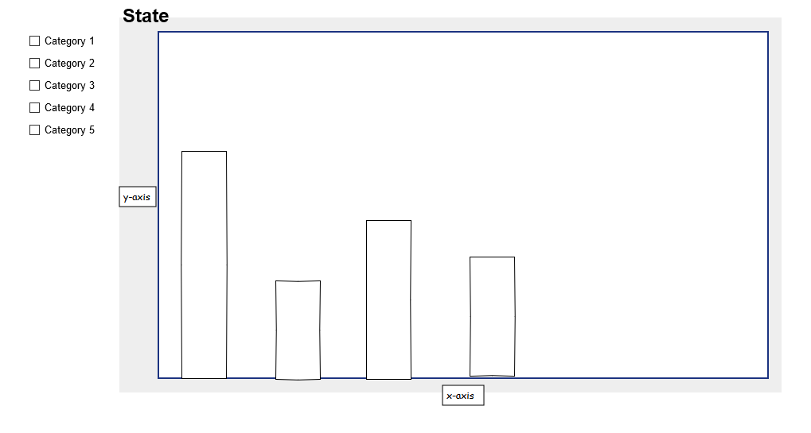

# Programmeerproject
Dit repository is voor het vak Programmeerproject van de minor Programmeren

## Project proposal
### Features
Deze visualizatie is bedoeld om misdaadcijfers te vergelijken met bijvoorbeeld het aantal gevangenen en werkloosheidcijfers. Daarnaast is er de mogelijkheid om misdaadcijfers te vergelijken met de hoeveelheid wapens die in Amerika worden gebruikt. Door de gebruiker zelf te laten kiezen welke categorie met wat te vergelijken kan de gebruiker zich een duidelijk beeld schetsen van de impact die bijvoorbeeld wapengebruik heeft in Amerika. Of hoe werkloosheid zich verhoudt tot de hoeveelheid misdaden. Naast Amerika kan de gebruiker ook de cijfers zien per staat. De bebruiker kan kiezen voor een staat door middel van een kaart van Amerika met alle staten, daarnaast is er een optie om statistieken te zien voor heel Amerika.

### Sketches
SVG Map United States

Visualization by state

### Data
Gebruikte datasets:
https://www.fbi.gov/about-us/cjis/ucr/crime-in-the-u.s/2010/crime-in-the-u.s.-2010/tables/10tbl20.xls
https://github.com/jldbc/gunsandcrime/blob/master/gun_crime_data.csv

Mogelijk komen er nog meer bij, bijvoorbeeld unemployment rates per state etc.

Om de data bruikbaar te maken zal ik python gebruiken om de data om te zetten naar json formaat, wat makkelijk gebruikt kan worden door de D3 library voor javascript.

###
